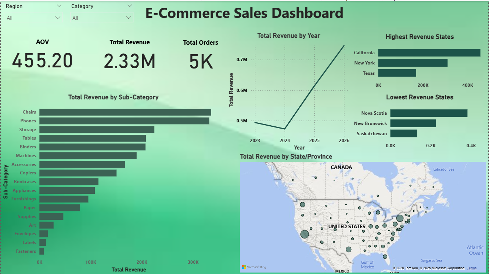

# E-Commerce Sales Performance Analysis 🛒📊

## 📌 Project Overview
This project focuses on analyzing an e-commerce dataset (Superstore) to extract actionable business insights. The goal was to transform raw sales data into a comprehensive, interactive dashboard that helps stakeholders track performance, identify trends, and make data-driven decisions.

## 🖼️ Dashboard Preview

## 🧹 Data Preparation & Cleaning (Excel)
Before building the dashboard, the raw data underwent a thorough cleaning process using **Microsoft Excel**. Key steps included:
- Removing duplicates and handling missing values.
- Formatting data types (Dates, Currency, Text) for seamless integration.
- Ensuring data integrity for accurate KPI calculations.

## 📈 Key Metrics Evaluated (KPIs)
Calculated using **DAX** in Power BI:
- **Total Revenue:** $2.33M
- **Total Orders:** 5K
- **Average Order Value (AOV):** $455.20

## 💡 Top Business Insights
1. **Geographic Dominance:** California and New York are leading the revenue charts, highlighting strong market penetration in these states.
2. **Top Performing Categories:** 'Chairs' and 'Phones' are the highest revenue-generating sub-categories.
3. **Revenue Trends:** A significant upward trend in overall sales is clearly visible moving into the latest financial year, indicating business growth.

## 🛠️ Tools & Technologies Used
- **Microsoft Excel:** Data Cleaning, Exploration, and Preparation.
- **Power BI:** Data Modeling, DAX (Data Analysis Expressions), and Interactive Visualization.

## 📂 Files in this Repository
- `E-Commerce_Dashboard.pbix`: The interactive Power BI dashboard file.
- `samplesuperstore_2.xlsx`: The cleaned dataset used for the analysis.
- `Dashboard.png`: Screenshot of the final dashboard.

## 🚀 How to Use
1. Download the `.pbix` file.
2. Open it using Power BI Desktop.
3. Interact with the slicers (Region, Category) to explore the data dynamically.
